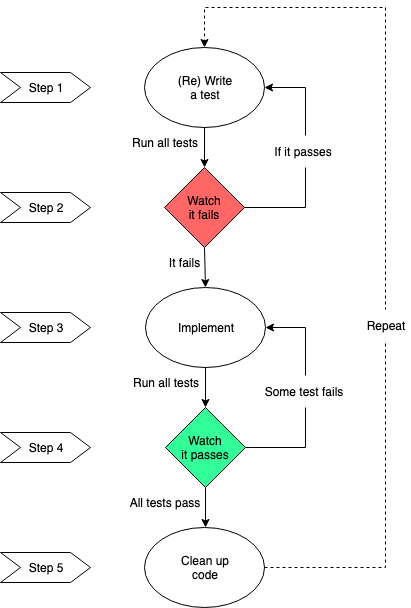
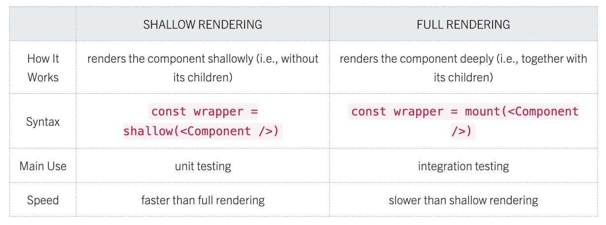

# Tutor / Mentor CF version

Check out [CareerFoundry](https://careerfoundry.com/) for more information on
this lesson.

## To test serverless function locally

Example:

- Obtain `code` from redirect:
  `https://secure.meetup.com/oauth2/authorize?client_id=j12j4mvc0gjql1p5is9iu8uib3&response_type=code&redirect_uri=http://iamwill123.github.io/meetup-cf-tdd-app`

In terminal:

- any updates we make to our auth-server, we must run: `serverless deploy`
- for getAccessToken(), run:
  `serverless invoke local --function getAccessToken --data '{"pathParameters": { "code": "346606ee94eb4970a171d872091d4826" }}'`

- for getRefreshAccessToken() run:
  `serverless invoke local --function getRefreshAccessToken --data '{"pathParameters": { "code": "e34d8a76340fdfe4a94ff8a021073f1c" }}'`

References:

- https://serverless-stack.com/chapters/load-secrets-from-env-yml.html

# Key features of app:

[Project requirements](https://images.careerfoundry.com/public/courses/fullstack-immersion/A4/Full-Stack%20Immersion%20Achievement%204%20Project%20Brief%20-%20Meetup%20App.pdf)

1. It must be able to filter events by city.
2. It must be able to show/hide an event details.
3. It must specify the number of events.

4. It must be available offline.
5. It must display a chart showing the number of upcoming events by date.

6. It must add an app shortcut to the user’s home screen. (Won’t be handled by
   our app, rather, the user’s OS)

By default, the `yarn test` command will tell Jest to run your tests in “watch”
mode.

Reference: Enzyme documentation on the shallow wrapper API:
https://airbnb.io/enzyme/docs/api/shallow.html#shallowwrapper-api
https://www.meetup.com/meetup_api/docs/find/locations/

Enable CORS through AWS:
https://docs.aws.amazon.com/apigateway/latest/developerguide/how-to-cors.html

Testing Resources: https://airbnb.io/enzyme/docs/api/ShallowWrapper/
